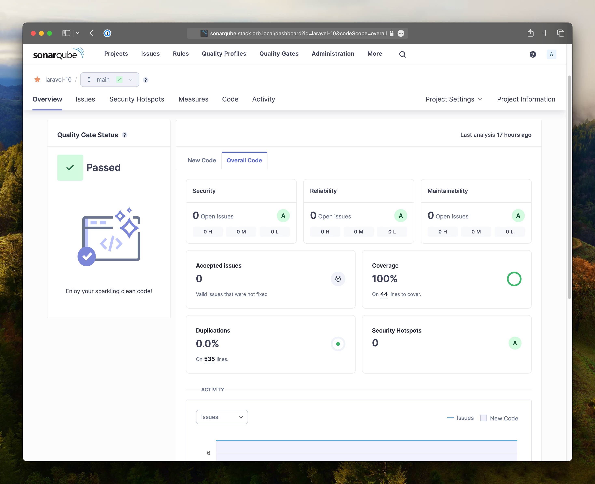

Menjaga kualitas kode dalam setiap proyek adalah tantangan yang harus dihadapi oleh setiap _developer_. Sebagai seorang developer **full stack** yang dapat diandalkan, Anda pasti memahami betapa pentingnya memastikan integritas dan keberlanjutan proyek Anda.

Untuk itu, penggunaan alat analisis kode seperti [SonarQube](https://www.sonarsource.com/products/sonarqube/) menjadi sangat penting. Namun, seringkali proses _scanning_ dan _configurating_ `sonar-scanner` dapat menjadi hambatan bagi beberapa developer.

Selain itu, saya sering kali menemukan kendala bahwa _code coverage_ dari tes yang dilakukan tidak langsung dimasukkan ke dalam laporan SonarQube. Hal ini dapat menyulitkan dalam memantau kualitas kode secara menyeluruh.

Nah, kali ini saya akan memperkenalkan sebuah solusi praktis yang dapat membantu Anda dalam mengintegrasikan analisis kode yang kita buat ke SonarQube, dalam alur kerja proyek Laravel.

Perkenalkan, "[Docker Image: Varian Laravel SonarScanner untuk Analisis Kode PHP](https://hub.docker.com/r/ramageek/image/tags?page=&page_size=&ordering=&name=%25-laravel-sonar)". Dengan memanfaatkan kekuatan **Docker**, kita dapat dengan mudah menjalankan analisis kode tanpa harus menginstal dan mengonfigurasi `sonar-scanner` secara manual.

## Table of contents

## Fitur-fitur Unggulan

Docker Image ini memiliki beberapa fitur unggulan yang dapat membantu Anda dalam meningkatkan kualitas kode PHP Anda:

1. **Berbasis pada Server Side Up PHP Docker Images**

   - Docker Image ini dibangun di atas base image **[serversideup/php](https://serversideup.net/open-source/docker-php/)**, yang telah dioptimalkan untuk _production-ready_.

2. **Menyertakan Ekstensi Penting**

   - Docker Image ini telah dilengkapi dengan ekstensi PHP yang penting, seperti `openswoole` dan `xdebug`, sehingga Anda dapat langsung menggunakannya tanpa perlu mengonfigurasi lebih lanjut.

3. **Terintegrasi dengan SonarScanner**

   - Selain menyiapkan lingkungan Laravel, Docker Image ini juga mengunduh dan menginstal SonarScanner CLI versi 5.0.1.3006, sehingga Anda dapat langsung menjalankan analisis kode menggunakan perintah "sonar-scanner".

4. **Mudah Digunakan**

   - Cukup dengan menjalankan perintah satu baris pada alur kerja CI/CD Anda, Docker Image ini akan mengatur segalanya, mulai dari konfigurasi Laravel, migrasi database, hingga eksekusi analisis kode SonarQube.

## Contoh Penggunaan

Untuk menunjukkan bagaimana Anda dapat memanfaatkan Docker Image ini, mari kita lihat contoh penggunaannya pada alur kerja [GitHub Actions](https://github.com/ramaID/laravel-starter):

```yaml
name: Quality Check

on:
  push:
    branches: [main]
  pull_request:
    branches: [main]

jobs:
  quality-check:
    runs-on: ubuntu-latest

    container:
      image: ramageek/image:php8.3-laravel-sonar

    steps:
      - uses: actions/checkout@v2

      - name: Setup application with code quality check
        run: |
          cp .env.example .env
          touch database/database.sqlite
          composer install --no-interaction --optimize-autoloader
          php artisan key:gen
          php artisan migrate --seed
          composer qc

      - name: Sonar scanning
        run: |
          cp sonar-project.properties.example sonar-project.properties
          sonar-scanner -Dsonar.login=$SONAR_LOGIN_TOKEN
```

Pada contoh di atas, kita menggunakan tindakan GitHub Actions yang memanfaatkan Docker Image "ramageek/image:php8.3-laravel-sonar". Tindakan ini akan menjalankan rangkaian tugas berikut:

1. Checkout kode sumber Anda.
2. Menyalin file `.env.example` ke `.env`.
3. Membuat file database SQLite.
4. Menjalankan perintah Composer yang diperlukan, seperti install, key generation, migrasi, dan quality check.
5. Menyalin file `sonar-project.properties.example` ke `sonar-project.properties`.
6. Menjalankan analisis kode menggunakan perintah `sonar-scanner`.

Semua ini dilakukan dalam konteks Docker, sehingga Anda tidak perlu menginstal atau mengonfigurasi SonarScanner secara manual.

### Contoh Penggunaan pada GitLab CI/CD

Jika Anda menggunakan GitLab CI/CD, Anda juga dapat memanfaatkan Docker Image ini dalam alur kerja CI/CD Anda. Berikut adalah contoh penggunaannya:

```yaml
stages:
  - quality-check

quality-check:
  stage: quality-check
  image:
    name: ramageek/image:php8.3-laravel-sonar
    entrypoint: [""]
  cache:
    paths:
      - .sonar/cache
  script:
    - cp .env.example .env
    - touch database/database.sqlite
    - composer install --no-interaction --optimize-autoloader
    - php artisan key:gen
    - php artisan migrate --seed
    - composer qc
    - cp sonar-project.properties.example sonar-project.properties
    - sonar-scanner -Dsonar.login=$SONAR_LOGIN_TOKEN
  only:
    - main
```

Hasilnya, bisa kalian lihat gambar dibawah ini:



## Mulai Meningkatkan Kualitas Kode Anda Sekarang

Dengan Docker Image: Varian Laravel SonarScanner, kita dapat dengan mudah mengintegrasikan analisis kode SonarQube ke dalam alur kerja proyek Laravel Anda. Tidak hanya itu, Anda juga mendapatkan lingkungan pengembangan yang telah dioptimalkan, lengkap dengan ekstensi PHP yang penting.

Jadi, tunggu apa lagi? Segera manfaatkan Docker Image ini untuk meningkatkan kualitas kode PHP Anda dan pastikan proyek Anda tetap terjaga kesehatannya. Semoga artikel ini bermanfaat bagi Anda!

> P.S. Dikarenakan ada masalah kompatibilitas dengan prosesor Apple Silicon, bagi pengguna Mac dengan prosesor keluarga M dapat menggunakan [SonarScanner dari Homebrew](https://formulae.brew.sh/formula/sonar-scanner).
