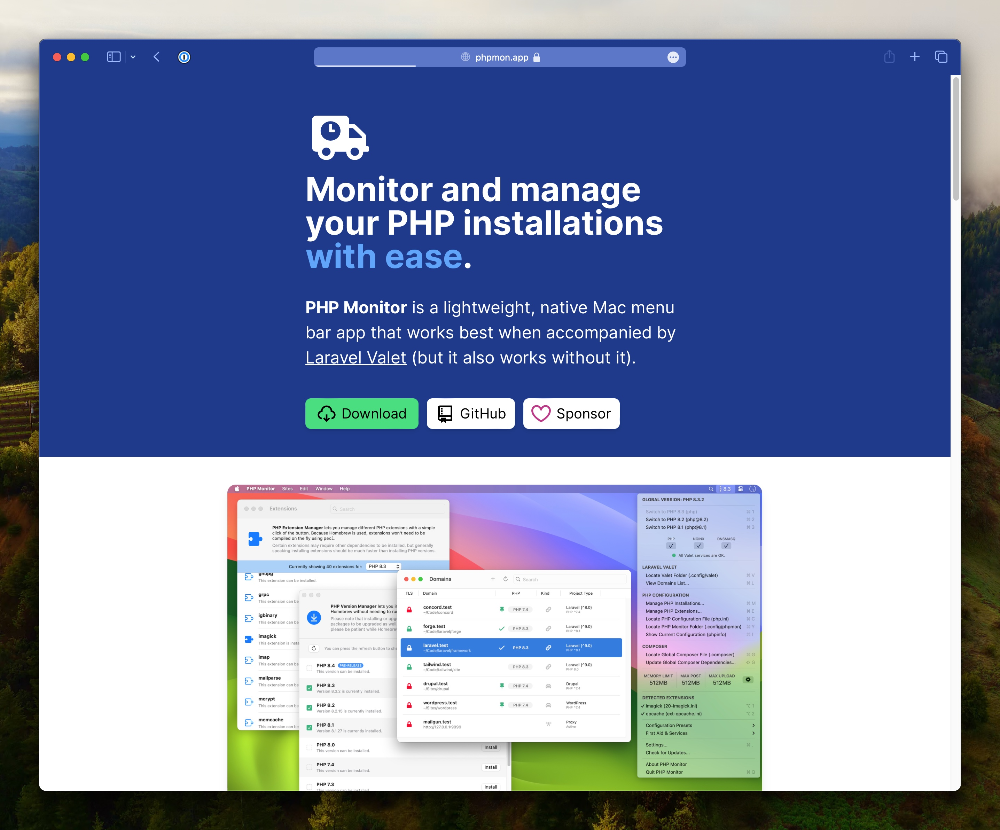
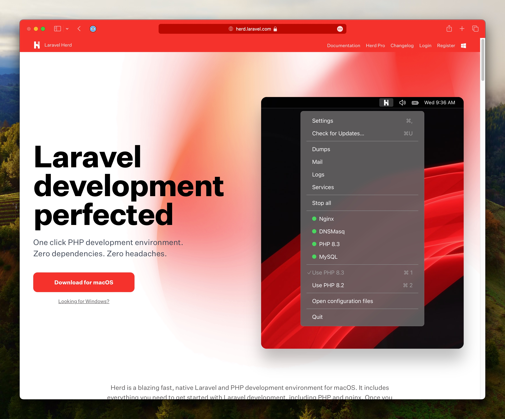
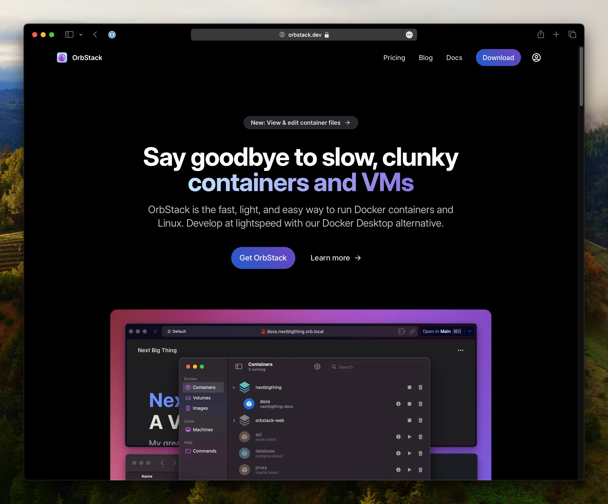

Sebagai seorang developer full stack yang berfokus pada pengembangan aplikasi web menggunakan Laravel, saya sebelumnya memanfaatkan alat pengembangan lokal yang cukup populer, yaitu [Laravel Valet](https://laravel.com/docs/11.x/valet). Valet telah lama menjadi pilihan saya untuk menjalankan server web di lingkungan lokal, dengan kemudahan konfigurasi dan dukungan untuk domain kustom yang membuatnya sangat populer di kalangan developer Laravel.

Selain itu, saya juga menggunakan [PHPMonitor](https://phpmon.app), sebuah aplikasi menu bar ringan untuk memantau dan mengelola instalasi PHP saya dengan mudah. PHPMonitor bekerja dengan baik ketika digunakan bersama dengan Laravel Valet, tetapi juga dapat digunakan tanpa Valet.

## Table of contents

## Migrasi ke Laravel Herd dan OrbStack

Dalam upaya untuk membuat lingkungan pengembangan lokal saya lebih terorganisir dan efisien, saya memutuskan untuk beralih ke solusi yang lebih modern dan fleksibel. Pertama-tama, saya mulai mengeksplorasi [Laravel Herd](https://herd.laravel.com), sebuah solusi kontainerisasi khusus untuk aplikasi Laravel.

Laravel Herd menawarkan beberapa keuntungan yang menarik bagi saya. Pertama, ia memungkinkan saya untuk menjalankan beberapa proyek Laravel secara paralel dengan mudah, tanpa perlu khawatir tentang konflik dependensi atau versi. Selain itu, pendekatan kontainerisasi Laravel Herd memastikan bahwa lingkungan pengembangan saya tetap konsisten dan dapat direproduksi dengan mudah.

## Mengapa Memilih OrbStack?

Meskipun saya tertarik dengan fitur-fitur Laravel Herd, saya belum dapat mengalokasikan anggaran untuk berlangganan layanan premium mereka, yaitu Laravel Herd Pro. Untungnya, saya menemukan solusi yang cocok untuk kebutuhan saya saat ini: [OrbStack](https://orbstack.dev).

OrbStack adalah alternatif Docker Desktop yang ringan dan mudah digunakan, yang memungkinkan saya untuk menjalankan kontainer Docker dan Linux dengan cepat dan efisien. Dengan OrbStack, saya dapat memanfaatkan manfaat kontainerisasi tanpa harus berurusan dengan kerumitan pengaturan yang terkadang ditemui saat menggunakan Docker Desktop secara langsung.

Ada beberapa alasan mengapa saya memilih OrbStack sebagai solusi kontainerisasi pendukung untuk lingkungan pengembangan lokal saya:

1. **Kinerja yang Cepat**: OrbStack mengklaim dapat menjalankan kontainer dengan kecepatan "kilat", jauh lebih cepat dibandingkan dengan solusi kontainerisasi tradisional.

2. **Mudah Digunakan**: Antarmuka pengguna OrbStack yang intuitif dan mudah digunakan membuatnya mudah dipahami dan dikonfigurasi.

3. **Hemat Sumber Daya**: OrbStack dikenal dengan penggunaan sumber daya yang lebih ringan dibandingkan dengan solusi kontainerisasi lainnya.

4. **Biaya yang Terjangkau**: OrbStack menawarkan solusi kontainerisasi yang terjangkau, dengan opsi berlangganan seperti OrbStack Pro ($8 per pengguna per bulan) untuk kebutuhan komersial dan bisnis.

## Kesimpulan

Migrasi ke Laravel Herd dan OrbStack telah membawa dampak positif bagi lingkungan pengembangan lokal saya. Dengan kemampuan kontainerisasi yang disediakan oleh kedua alat ini, saya dapat mengelola proyek-proyek Laravel saya dengan lebih efisien, terorganisir, dan konsisten.

Saya sangat menyarankan pengembang Laravel lainnya untuk mempertimbangkan migrasi ke lingkungan yang lebih kontemporer dan terkelola dengan baik. Investasi waktu dan upaya dalam menyiapkan lingkungan pengembangan lokal yang optimal akan membawa manfaat jangka panjang bagi produktivitas dan kualitas kode Anda.
