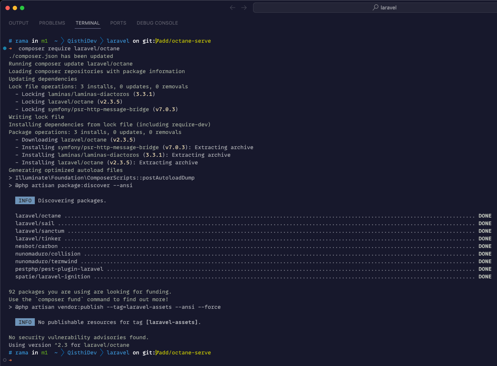
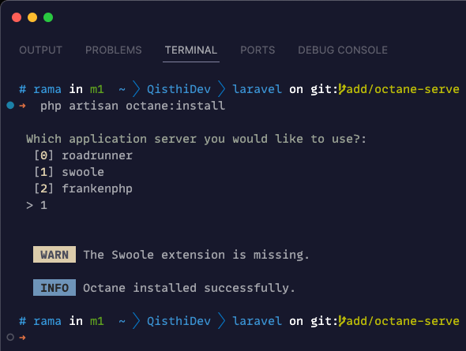
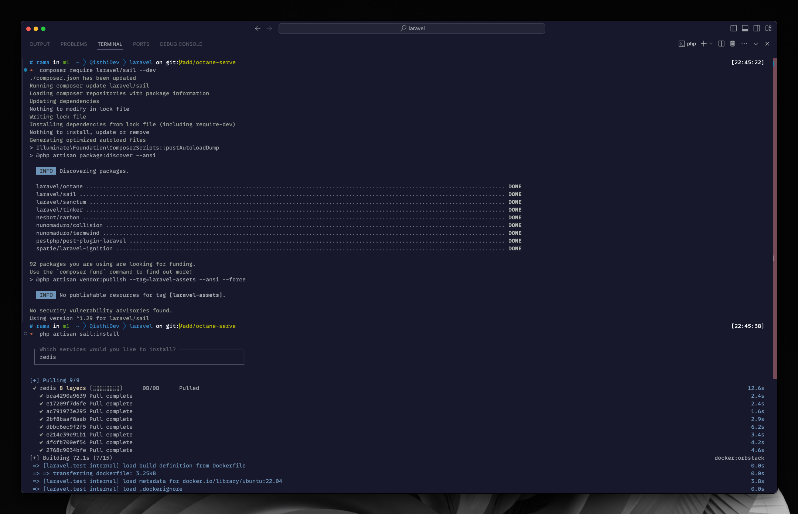
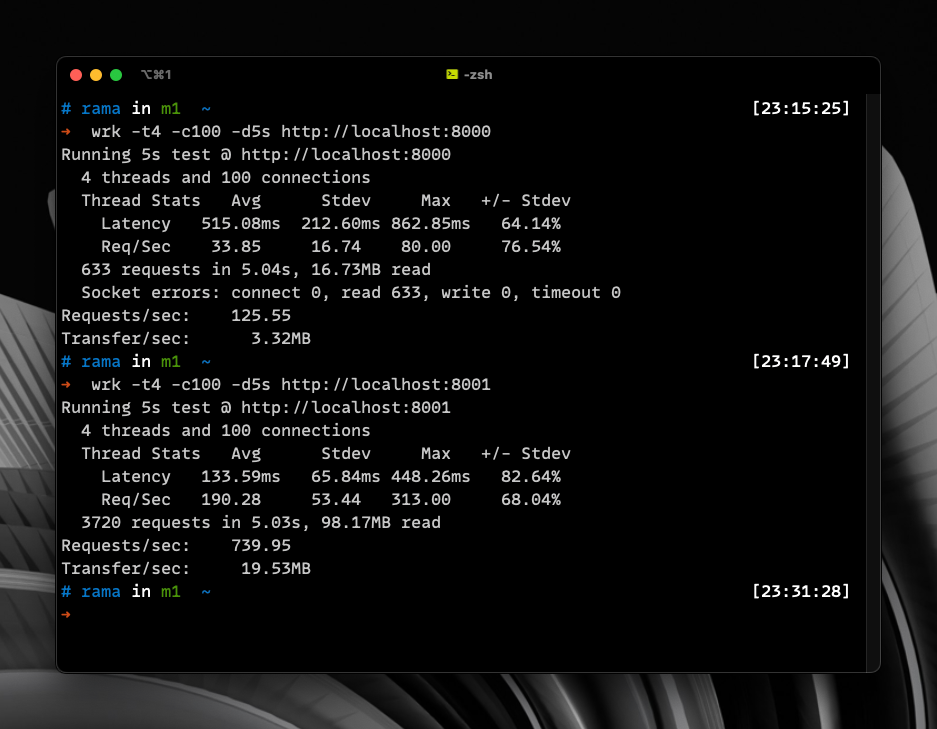

Laravel Octane muncul sebagai solusi inovatif untuk meningkatkan skalabilitas dan performa aplikasi Laravel, mirip dengan bagaimana SpaceX mengubah industri penerbangan luar angkasa dengan roket Falcon 9 yang dapat digunakan kembali. Sebelum adanya Octane, setiap permintaan yang ditangani oleh aplikasi Laravel memerlukan pembangunan ulang dari state aplikasi, yang memakan waktu dan sumber daya server. Dengan menggunakan Octane, aplikasi Laravel dapat membangun state sekali dan menggunakan kembali untuk menangani banyak permintaan, mengurangi beban server dan meningkatkan jumlah permintaan yang dapat ditangani per detik.

## Table of contents

## Mengapa Octane Penting?

Banyak yang menganggap Octane hanya membuat aplikasi terlihat lebih cepat bagi pengguna akhir, tetapi sebenarnya, manfaat utama dari Octane terletak pada peningkatan throughput permintaan. Ini berarti server dapat menangani lebih banyak permintaan dalam waktu yang sama, membuat aplikasi lebih skalabel dan efisien. Dengan meminimalisir pembangunan ulang state aplikasi untuk setiap permintaan, Octane memungkinkan penggunaan sumber daya server secara lebih efektif.

## Cara Kerja Octane

Untuk menjalankan Octane pada mesin lokal atau server virtual, diperlukan instalasi ekstensi PHP **Open Swoole**, **Swoole**, atau penggunaan library **Roadrunner**. Langkah pertama adalah menginstal Octane menggunakan `composer`, kemudian memilih antara _Swoole_, _Roadrunner_ atau _FrankenPHP_ sebagai server. Octane menambahkan file konfigurasi `octane.php` baru ke proyek, memungkinkan penyesuaian pengaturan server dan perilaku aplikasi.

Salah satu keuntungan besar Octane adalah kemampuannya untuk dipasang dengan mudah menggunakan Laravel Sail, yang menyediakan lingkungan Docker yang sudah dikonfigurasi untuk aplikasi Laravel. Ini mempermudah pengembangan dan pengujian aplikasi dengan Octane tanpa perlu menginstal ekstensi PHP secara manual pada mesin pengembang.

## Menginstal dan Menjalankan Octane dengan Laravel Sail

Laravel Sail menyederhanakan proses pemasangan dan penggunaan Octane dengan menyediakan skrip Docker yang memasang ekstensi _Swoole_, _Roadrunner_ atau _FrankenPHP_, tergantung pilihan pengembang. Dengan menggunakan Sail, pengembang dapat dengan mudah menjalankan aplikasi Laravel dengan Octane dalam kontainer Docker, memastikan lingkungan pengembangan yang konsisten dan mudah untuk di-duplikasi.

Setelah menginstal Sail dan Octane, pengembang dapat menyesuaikan file konfigurasi `octane.php` dan `docker` untuk mengoptimalkan pengaturan sesuai dengan kebutuhan aplikasi. Ini termasuk konfigurasi server, pemaksaan HTTPS, dan registrasi listener untuk event-event Octane.

## Kesimpulan

Laravel Octane menawarkan cara yang efisien dan skalabel untuk meningkatkan performa aplikasi Laravel. Dengan memanfaatkan konsep aplikasi state yang dibangun sekali dan digunakan kembali, Octane mengurangi beban server dan meningkatkan throughput permintaan secara signifikan. Integrasi dengan Laravel Sail menjadikan Octane mudah untuk diinstal dan dikonfigurasi, bahkan bagi pengembang yang baru mengenal teknologi ini.

Dari hasil pengujian beban yang dilakukan, dapat dilihat bahwa penggunaan Laravel Octane dengan Swoole pada Macbook Pro M1 2020 memberikan peningkatan kinerja yang luar biasa dibandingkan aplikasi Laravel konvensional. Latency rata-rata berkurang dari 515.08ms menjadi 133.59ms, sementara throughput request meningkat dari 33.85 Req/Sec menjadi 190.28 Req/Sec, dan throughput transfer data dari 3.32MB/Sec menjadi 19.53MB/Sec. Dengan kata lain, terjadi peningkatan throughput yang signifikan, membuktikan bahwa Octane mampu mengoptimalkan kinerja aplikasi Laravel Anda.

Dengan memanfaatkan kekuatan Octane, Anda dapat memastikan aplikasi Laravel Anda siap menghadapi lonjakan lalu lintas dan tuntutan kinerja yang tinggi. Apakah Anda memilih SWOL atau Roadrunner sebagai server Octane, QisthiDev akan memandu Anda melalui proses konfigurasi dan penyesuaian untuk memaksimalkan potensi Octane dalam meningkatkan performa aplikasi Anda.

Jangan ragu untuk bergabung dalam perjalanan ini bersama QisthiDev. Dengan panduan yang tepat dan teknologi Octane yang canggih, Anda dapat membuat aplikasi Laravel Anda lebih lincah, lebih responsif, dan siap menghadapi segala tantangan skalabilitas yang ada di depan. Masa depan aplikasi web yang cepat dan efisien ada di tangan Anda!
