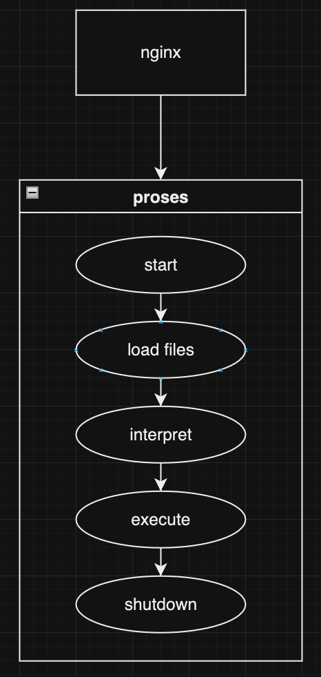
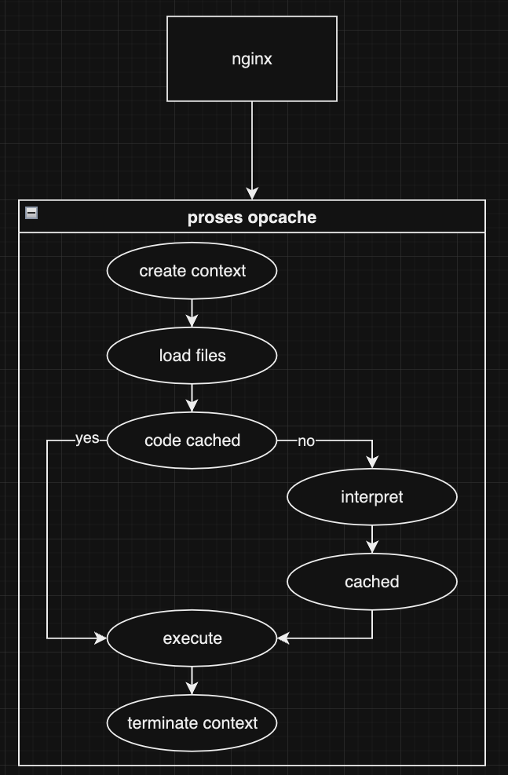

Dalam dunia pengembangan web yang dinamis ini, kami senantiasa mencari solusi untuk membuat aplikasi kita lebih efisien, lebih cepat, dan lebih lincah. Tidak peduli seberapa canggih teknologi yang kita gunakan, tantangan utama yang selalu kita hadapi adalah bagaimana meningkatkan kinerja tanpa harus mengeluarkan banyak biaya untuk infrastruktur yang lebih mahal.

Di sinilah Laravel Octane hadir sebagai jawaban atas permasalahan tersebut. Diciptakan oleh Taylor Otwell, sang _mastermind_ di balik kerangka kerja Laravel, Octane menawarkan solusi yang revolusioner untuk meningkatkan skalabilitas dan kinerja aplikasi Laravel Anda.

Bayangkan sebuah aplikasi PHP yang harus memulai proses baru untuk setiap permintaan yang masuk. Proses ini tidak hanya memakan waktu CPU yang berharga, tetapi juga sangat mahal dari sisi sumber daya. Dengan Laravel Octane, aplikasi Laravel Anda hanya perlu dimuat sekali saja, dan instance yang sama dapat digunakan untuk memproses semua permintaan masuk. Ini berarti aplikasi Anda dapat menangani lebih banyak permintaan tanpa perlu berinvestasi pada server yang lebih mahal.

Seperti yang kita ketahui, PHP melalui Zend Engine harus menerjemahkan skrip PHP menjadi opcode, dan kemudian menerjemahkannya lagi menjadi kode mesin yang dapat dieksekusi oleh CPU. Proses ini terjadi setiap kali aplikasi menerima _request_ baru, yang jelas merupakan proses yang sangat mahal. Namun, dengan adanya ekstensi opcode cache di PHP, proses interpretasi kode menjadi lebih cepat karena opcode yang dihasilkan dapat disimpan dan digunakan kembali untuk permintaan selanjutnya.

Laravel Octane memanfaatkan fitur ini untuk mempercepat eksekusi aplikasi Laravel. Dengan memuat aplikasi sekali saja dan memanfaatkan instance yang sama untuk memproses semua permintaan masuk, Octane menawarkan solusi yang sangat menarik bagi aplikasi Laravel yang mengalami lalu lintas tinggi.

Dalam perjalanan kita berikutnya, kita akan menjelajahi lebih dalam mengenai Laravel Octane dan bagaimana teknologi ini dapat merevolusi cara aplikasi Laravel Anda menangani permintaan. Kita akan mempelajari tips dan trik untuk mengoptimalkan performa, meningkatkan skalabilitas, dan memastikan aplikasi Anda siap menghadapi tantangan lalu lintas yang tinggi.

Jadi, pastikan Anda tetap waspada dan siap untuk mempelajari kiat-kiat berharga dari QisthiDev. Bersama-sama, kita akan membuat aplikasi Laravel kita lebih lincah, lebih cepat, dan siap untuk menghadapi segala tantangan yang ada di depan.

Sampai jumpa di artikel berikutnya!
