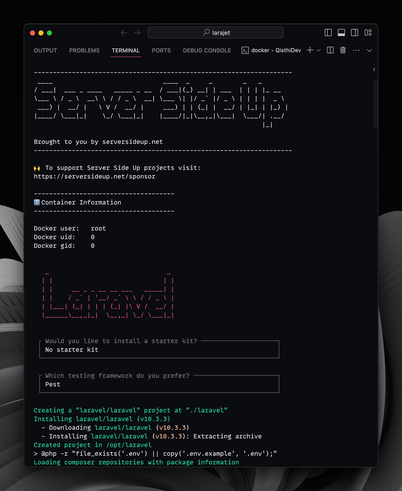
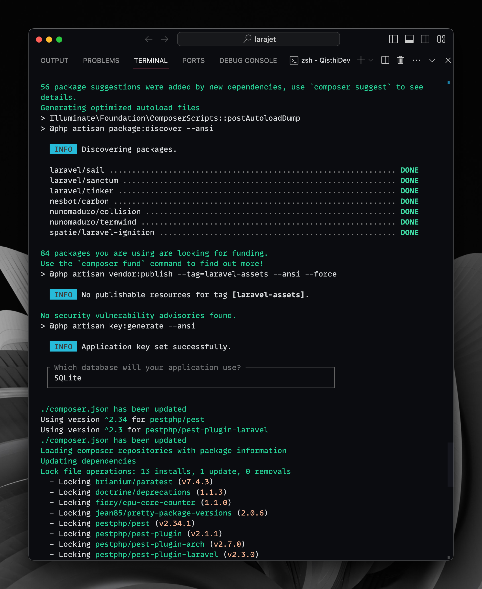
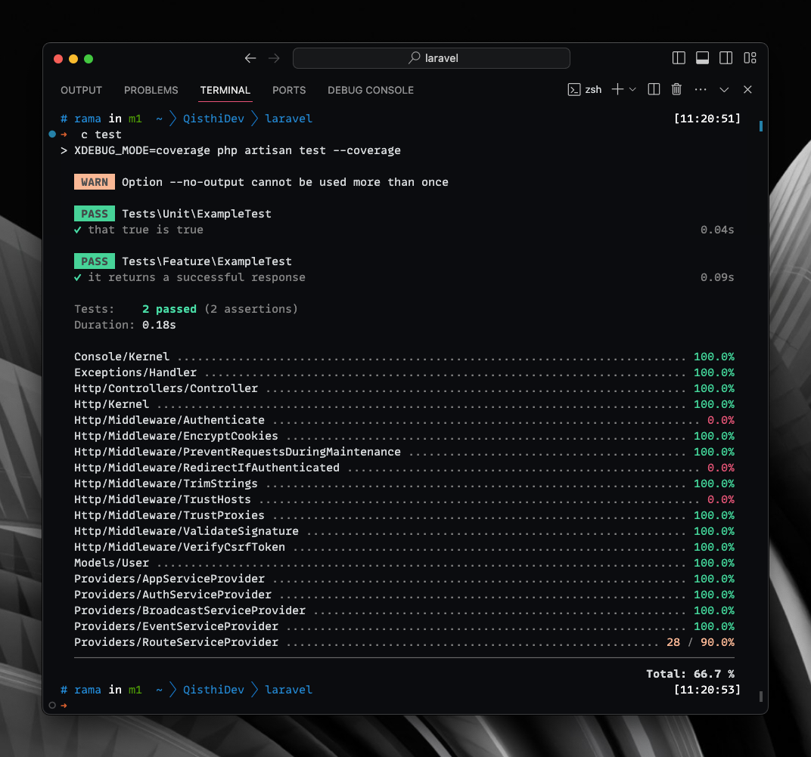
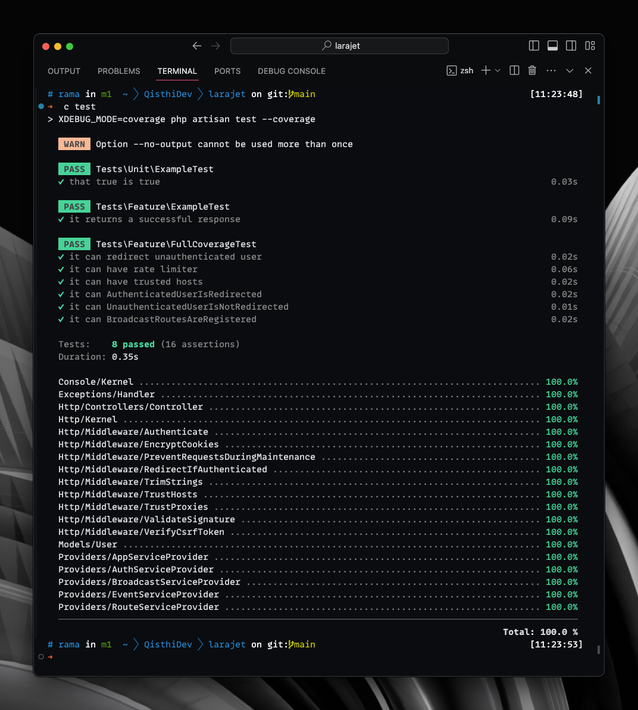

Dalam pengembangan perangkat lunak, _code coverage_ adalah metrik yang menunjukkan persentase kode yang telah diuji oleh _test suite_ kita. Nilai yang tinggi pada code coverage dapat menurunkan potensi bug dan meningkatkan kualitas aplikasi. Artikel ini akan membimbing Anda mencapai 100% code coverage di aplikasi Laravel Anda dengan tips dan trik praktis.

## Table of contents

## 1. Instalasi Laravel dengan Docker



Memulai dengan Laravel yang terinstal menggunakan Docker akan mempermudah pengelolaan lingkungan pengembangan. Berikut adalah perintah untuk memulainya:

```bash
docker run --rm \
    --pull=always \
    -v "$(pwd)":/opt \
    -w /opt \
    -it ramageek/image:php8.3-laravel \
    bash -c "/composer/vendor/bin/laravel new laravel"
```

Gunakan konfigurasi aplikasi Laravel berikut:

- Tidak menggunakan starter kit
- PestPHP sebagai kerangka kerja pengujian
- SQLite sebagai database



## 2. Mempersiapkan Lingkungan Testing

Anda dapat menyiapkan lingkungan pengujian dengan mengikuti panduan pada video ini: [persiapan environment untuk testing di Laravel dengan Pest](https://youtu.be/fvRdS4qb624). Rincian singkatnya:

### Shortcut running test suite

Buat shortcut di `composer.json` pada block `scripts` dengan nama `test`, isinya:

```
XDEBUG_MODE=coverage php artisan test --coverage
```

### Berkas `.env.testing`

Buat berkas `.env.testing`, dengan isian:

```
APP_KEY=
DB_CONNECTION=sqlite
DB_DATABASE=:memory:
```

Kemudian running perintah `php artisan key:generate --env=testing` untuk mengisi _variable_ **APP_KEY** diatas.

### Modifikasi `Pest.php`

Kita akan melakukan refresh database pada setiap test case yang dijalankan, buka berkas `tests/Pest.php`, _uncomment_ baris 16 yang berguna untuk memuat `Illuminate\Foundation\Testing\RefreshDatabase::class`.

## 3. Memastikan Current State Code Coverage

Sebelum meningkatkan code coverage, kita perlu tahu sejauh mana cakupan tes kita saat ini. Untuk ini, kita akan menjalankan perintah `composer test` yang sudah kita buat sebelumnya.



## 4. Membuat Test Case

Prioritaskan pembuatan test case yang efektif untuk fungsi dan metode yang kritikal. Gunakan prinsip **FIRST** (_Fast_, _Independent_, _Repeatable_, _Self-Validating_, _Timely_) dalam mengembangkan test case yang baik. Manfaatkan Factory dan Seeder Laravel untuk mempersiapkan data dummy. Test case yang dapat Anda buat untuk melengkapi capaian code coverage 100% di _fresh codebase_ Laravel versi 10 adalah sebagai berikut:

```php
<?php

use App\Console\Kernel;
use App\Http\Middleware\RedirectIfAuthenticated;
use App\Models\User;
use App\Providers\BroadcastServiceProvider;
use App\Providers\RouteServiceProvider;
use Illuminate\Console\Scheduling\Schedule;
use Illuminate\Foundation\Application;
use Illuminate\Http\RedirectResponse;
use Illuminate\Http\Request;
use Illuminate\Support\Facades\Auth;
use Illuminate\Support\Facades\Broadcast;
use Illuminate\Support\Facades\Route;
use PHPUnit\Framework\MockObject\MockObject;
use PHPUnit\Framework\MockObject\Rule\InvokedCount;
use Symfony\Component\HttpFoundation\Response;

use function Pest\Laravel\getJson;

it('can redirect unauthenticated user', function () {
    $response = getJson('/api/user');

    $response->assertStatus(401);
});

it('can have rate limiter', function () {
    $user = User::factory()->create();

    $this->actingAs($user);

    $response = getJson('/api/user');

    $response->assertStatus(200)
        ->assertHeader('X-Ratelimit-Limit', 60)
        ->assertHeader('X-Ratelimit-Remaining', 59);
});

it('can have trusted hosts', function () {
    $trustedHosts = app('App\Http\Middleware\TrustHosts')->hosts();
    $this->assertNotEmpty($trustedHosts);
});

it('can AuthenticatedUserIsRedirected', function () {
    Route::get('/home', fn () => 'Home')->name('home');

    // Mock the Auth facade to simulate an authenticated user
    Auth::shouldReceive('guard')->once()->andReturnSelf();
    Auth::shouldReceive('check')->once()->andReturn(true);

    $request = Request::create('/test', 'GET');
    $middleware = new RedirectIfAuthenticated;
    /** @var RedirectResponse */
    $response = $middleware->handle($request, function () {
        // do nothing
    });

    $this->assertEquals($response->getTargetUrl(), url(RouteServiceProvider::HOME));
});

it('can UnauthenticatedUserIsNotRedirected', function () {
    Route::get('/home', fn () => 'Home')->name('home');

    // Mock the Auth facade to simulate an unauthenticated user
    Auth::shouldReceive('guard')->once()->andReturnSelf();
    Auth::shouldReceive('check')->once()->andReturn(false);

    $request = Request::create('/test', 'GET');
    $middleware = new RedirectIfAuthenticated;

    $response = $middleware->handle($request, fn () => new Response());

    $this->assertInstanceOf(Response::class, $response);
});

it('can BroadcastRoutesAreRegistered', function () {
    Broadcast::shouldReceive('routes')->once();
    Broadcast::shouldReceive('channel')->andReturnSelf();

    $provider = new BroadcastServiceProvider($this->app);
    $provider->boot();
});

it('can schedule method', function () {
    $app = new Application;
    $events = new \Illuminate\Events\Dispatcher($app);

    $kernel = new Kernel($app, $events);

    /**
     * @var \PHPUnit\Framework\TestCase $this
     * @var MockObject $schedule
     * @var InvokedCount $once
     */
    $schedule = $this->createMock(Schedule::class);
    $once = $this->once();
    $schedule->expects($once)->method('command')->with('inspire')->willReturnSelf();

    // Use reflection to call protected method
    $reflection = new \ReflectionClass($kernel);
    $method = $reflection->getMethod('schedule');
    $method->setAccessible(true);

    $method->invokeArgs($kernel, [$schedule]);
});
```

Untuk penggunaan ulang, kode diatas dapat kalian akses melalui gist di GitHub [berkas test dengan PestPHP untuk Mencapai 100% Code Coverage di Aplikasi Laravel v10](https://gist.github.com/ramaID/20e4cc1726f91959d40cae38b690ed36). Jangan lupa menempatkan berkas tersebut pada folder `tests/Feature`, karena kode diatas bukanlah sebuah _unit test_.

## Hasil Code Coverage



Jangan lupa bahwa mencapai 100% code coverage bukan berarti kode kita bebas dari bug, tapi ini adalah langkah besar dalam menjamin kualitas kode yang lebih tinggi. Happy coding!

## Kesimpulan

Mencapai 100% code coverage adalah sebuah proses yang menuntut dedikasi dan usaha. Namun, dengan mengikuti langkah-langkah di atas, Anda dapat meningkatkan kualitas kode dan meminimalisir potensi bug di aplikasi Laravel Anda.
