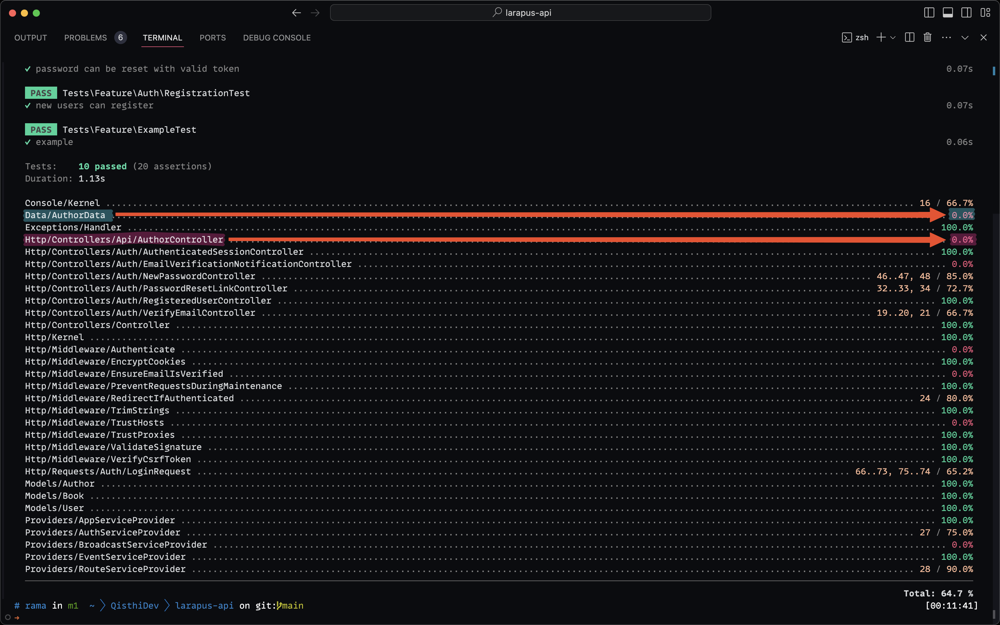
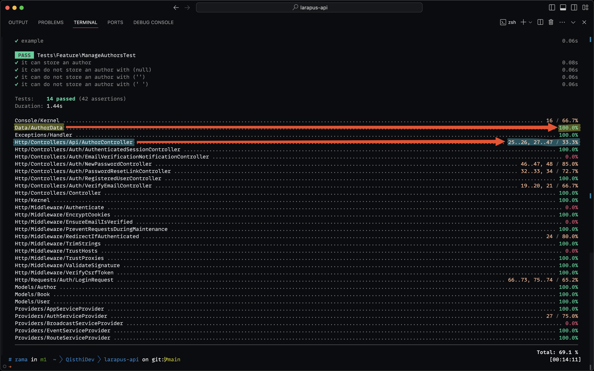

Selamat datang di dunia pengembangan web yang dinamis, dimana kode yang solid dan teruji adalah kunci sukses proyek Anda. Di era modern ini, menemukan alat dan metode yang tepat untuk menguji kode Anda bukan hanya tentang meminimalisir bug, namun juga tentang meningkatkan efisiensi pengembangan dan memastikan stabilitas aplikasi. Di artikel ini, kita akan membahas tentang bagaimana menguji JSON API Laravel menggunakan **Pest**, sebuah _framework_ testing PHP yang _powerful_.

## Table of contents

## Pengenalan

Dalam pengembangan aplikasi, khususnya yang menggunakan arsitektur JSON API, memastikan bahwa setiap endpoint berfungsi sebagaimana mestinya adalah penting. Laravel, salah satu _framework_ PHP terpopuler, disini saya menawarkan [Laravel Restify](https://www.qisthi.dev/posts/laravel-restify-solusi-elegan-untuk-pengembangan-api-di-laravel) yang mempermudah pembuatan API. Namun, tanpa pengujian yang tepat, kualitas _endpoint_ yang kita buat bisa jadi dipertanyakan. Di sinilah Pest, _framework testing_ yang dibuat khusus untuk PHP, berperan.

## Checking Code Coverage

Mari kita mulai dengan memeriksa _code coverage_ yang kita miliki saat ini dengan menggunakan _command_ berikut:

```sh
XDEBUG_MODE=coverage php artisan test --coverage
```

_Command_ ini akan memberikan kita gambaran tentang cakupan kode saat ini dan membantu kita mengidentifikasi area mana yang masih perlu peningkatan pengujian.



## Membuat Test

Langkah selanjutnya adalah membuat test baru untuk _endpoint_ POST kita. Berikut adalah cara membuat berkas _test_ baru dengan perintah **artisan**:

```sh
php artisan make:test ManageAuthorsTest --pest
```

Setelah berkas _test_ dibuat, kita bisa mulai menulis kode tes. Berikut ini contoh simple untuk tes _endpoint_ `POST`:

### Skenario: Positive Test

```php
use App\Models\User;

use function Pest\Laravel\postJson;

it('can store an author', function () {
    $user = User::factory()->create();

    $this->actingAs($user);

    $name = 'John Doe';
    $response = postJson('/api/v1/authors', compact('name'));
    $data = $response->json();

    expect($response->getStatusCode())->toBe(201)
        ->and($data)->name->toBe($name)
        ->and($data)->id->toBeString();

    $this->assertDatabaseHas('authors', compact('name'));
});
```

Pada contoh di atas, kita menggunakan _helper_ **_it_** dari Pest untuk mendefinisikan _test case_. Selanjutnya, kita melakukan _request POST_ ke _endpoint_ `/api/v1/authors` dan mengecek apakah _response_ yang diterima sesuai dengan yang diharapkan, yaitu status `201` dan nama _author_ yang tersimpan harus sesuai.

### Skenario: Negative Test

```php
...
it('can do not store an author', function (?string $name) {
    $user = User::factory()->create();

    $this->actingAs($user);

    $response = postJson('/api/v1/authors', compact('name'));
    $data = $response->json();
    $errors = $data['errors'];

    expect($response->getStatusCode())->toBe(422)
        ->and($data)->message->toBe('The name field is required.')
        ->and($errors)->toBeArray()
        ->and($errors['name'])->toBeArray()
        ->and($errors['name'][0])->toBe('The name field is required.');

    $this->assertDatabaseCount('authors', 0);
})->with([null, '', '  ']); // [!code highlight]
```

Di sini, kita menambahkan _test case_ untuk mengecek apakah _endpoint_ bisa menangani _request_ yang tidak valid dengan benar. Kita menggunakan chaining ke fungsi `with` untuk menentukan _payload_ yang akan digunakan dalam _test case_, yaitu `null`, _string_ kosong, dan _string_ yang hanya berisi spasi. Dengan cara ini, kita bisa memastikan bahwa _endpoint_ kita bisa menangani _request_ yang tidak valid dengan benar.

## Anatomi of a Test

Penting untuk memahami struktur dasar sebuah test, yang biasanya terdiri dari tiga bagian: Given, When, dan Then:

- **Given**: Kita mempersiapkan semua yang diperlukan untuk melakukan test.
- **When**: Melakukan aksi yang ingin kita test.
- **Then**: Memverifikasi bahwa hasilnya sesuai dengan yang diharapkan.

Mengikuti struktur ini akan membantu kita membuat test case yang jelas dan mudah dipahami.

## Validasi dan Kesimpulan

Setelah _test_ dibuat, mari kita lakukan validasi apakah cakupan kode kita sudah meningkat atau belum dengan menggunakan _command_ sebelumnya:

```sh
XDEBUG_MODE=coverage php artisan test --coverage
```

Melakukan ini akan menampilkan hasil _test_ dan kita bisa melihat apakah _test case_ kita berhasil atau tidak, serta melihat perubahan pada _code coverage_.



Dari hasil _test_ di atas, kita bisa melihat bahwa _code coverage_ kita sudah meningkat. Dengan demikian, kita bisa lebih yakin bahwa _endpoint_ yang kita buat sudah teruji dengan baik. Namun, capaian untuk berkas `AuthorController` masih belum 100%. Kita bisa menambahkan _test case_ untuk _endpoint_ lainnya, seperti `GET`, `PUT`, dan `DELETE` untuk mencapai _code coverage_ yang lebih baik.

## Penutup

Melakukan pengujian pada endpoint API Laravel menggunakan **Pest** adalah langkah penting dalam memastikan kualitas kode yang kita kembangkan. Dengan mengikuti panduan ini, kita dapat meningkatkan _code coverage_, memperbaiki kualitas pengembangan, dan menjamin stabilitas kode.

Terima kasih telah membaca, dan semoga informasi yang dibagikan bisa memberikan wawasan baru dalam pengembangan aplikasi Laravel Anda. Jangan lupa terus belajar dan mengasah kemampuan pengembangan Anda. Sampai jumpa di artikel berikutnya!
