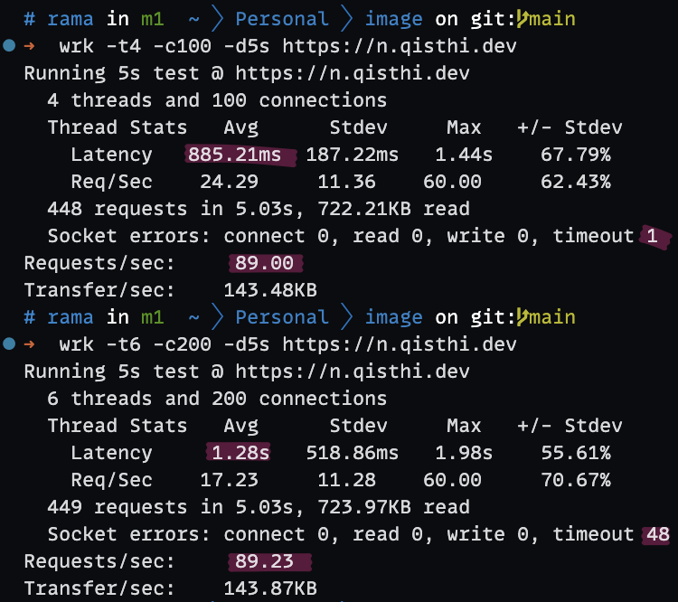
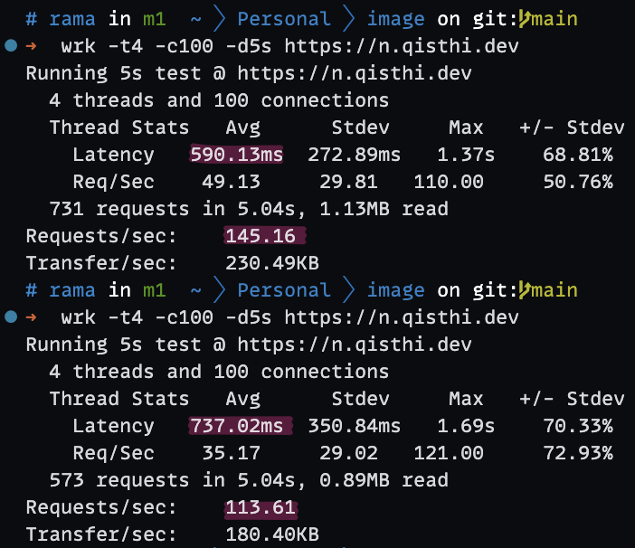

Dalam era digital saat ini, performa menjadi salah satu faktor kritis dalam kesuksesan aplikasi web. Aplikasi yang responsif tidak hanya meningkatkan kepuasan pengguna tetapi juga memainkan peran penting dalam SEO dan retensi pengguna. Laravel, salah satu framework yang populer di kalangan pengembang web, ketika dikombinasikan dengan Docker, menawarkan potensi yang luar biasa untuk memaksimalkan performa aplikasi. Dalam artikel ini, kita akan melakukan eksplorasi mendalam terhadap penerapan benchmark pada Laravel, terutama dalam konfigurasi yang menggunakan Docker, dan mendapatkan insight tentang metrik Requests Per Second (RPS) yang diperoleh.

## Table of contents

## Konfigurasi

Eksperimen ini dilakukan menggunakan Larapus API, sebuah aplikasi yang tersedia dalam sebuah [repository GitHub](https://github.com/ramaID/larapus-api). Deployment berhasil dilakukan menggunakan Docker Compose dengan konfigurasi yang telah dirancang untuk memaksimalkan efisiensi penggunaan sumber daya. Dengan mengadopsi image `serversideup/php:beta-8.3-unit` yang telah dimodifikasi untuk menambahkan ekstensi `opcache` dan `swoole`, kami berhasil menyiapkan lingkungan yang optimal untuk deployment aplikasi.

```dockerfile
FROM serversideup/php:beta-8.3-unit

RUN install-php-extensions opcache swoole
```

```yml
services:
  php:
    build:
      context: .
      dockerfile: Dockerfile
    ports:
      - "80:80"
      - "8000:8000"
    volumes:
      - ".:/var/www/html"
    networks:
      - larapus-api
networks:
  larapus-api:
    driver: bridge
```

### Proses Deployment

Langkah-langkah dalam proses deployment mencakup beberapa teknik caching yang direkomendasikan oleh dokumentasi [resmi Laravel](https://laravel.com/docs/10.x/deployment#optimization). Memanfaatkan Laravel Octane dan mengeksekusinya menggunakan Swoole memberikan perbedaan signifikan dalam cara aplikasi dihosting dan dijalankan, yang pada akhirnya menawarkan peningkatan performa dibandingkan konfigurasi Laravel standar.

Skenario testing yang kita lakukan adalah sebagai berikut:

1. `docker compose up -d --build` untuk memulai aplikasi standar Laravel.
2. Jalankan perintah `wrk -t4 -c100 -d5s https://n.qisthi.dev` 2 kali untuk melakukan benchmark.
3. `docker compose down` untuk menghentikan aplikasi standar Laravel.
4. Penyesuaian port, `8000:80` dan `80:8000` pada `docker-compose.yml` untuk menggunakan Laravel Octane.
5. Menjalankan perintah `docker compose up -d --build` untuk memulai aplikasi Laravel Octane.
6. `docker compose exec php bash` untuk masuk ke dalam container PHP.
7. Menjalankan perintah `php -d variables_order=EGPCS /var/www/html/artisan octane:start --server=swoole --host=0.0.0.0 --port=8000` untuk menjalankan Laravel Octane.
8. Menguji benchmark dengan perintah `wrk -t4 -c100 -d5s https://n.qisthi.dev` 2 kali.

### Hasil Benchmark

```sh
wrk -t4 -c100 -d5s https://n.qisthi.dev
```

Pengujian benchmark mengungkapkan perbedaan yang signifikan antara konfigurasi standar Laravel dan Laravel Octane. Hasilnya menunjukkan bahwa Laravel Octane mampu menawarkan latency yang lebih rendah serta RPS yang lebih tinggi, yang berkontribusi pada peningkatan kinerja keseluruhan aplikasi.

#### Laravel



#### Laravel Octane



### Diskusi dan Analisis

Analisis mendalam mengenai hasil benchmark ini mengungkapkan bagaimana kombinasi Docker, penggunaan ekstensi yang tepat seperti Swoole, dan strategi caching yang efisien dapat menghasilkan peningkatan performa yang signifikan. Terdapat potensi untuk optimasi lebih lanjut, dengan memperhatikan konfigurasi server dan kode aplikasi, demi mencapai performa yang optimal.

Untuk menghitung persentase peningkatan antara Laravel biasa dengan Laravel Octane berdasarkan Requests Per Second (RPS), kita dapat menggunakan data RPS yang diberikan:

- **Laravel Biasa**: 89,11 requests/second
- **Laravel Octane**: 129,38 requests/second

Jadi, terdapat persentase peningkatan sekitar 45,2% dari Laravel biasa ke Laravel Octane berdasarkan RPS.

### Server Konfigurasi

Untuk eksperimen ini, server yang digunakan ialah instance terendah dari [NevaCloud](https://nevacloud.com), sebuah penyedia layanan cloud yang menawarkan berbagai pilihan konfigurasi server. Server yang digunakan memiliki spesifikasi sebagai berikut:

- Sistem Operasi: Ubuntu 22.04 XFS
- CPU: 1 Core
- Memori: 1 GB
- Penyimpanan: 20 GB

Konfigurasi server ini memberikan konteks tambahan terhadap batasan sumber daya yang harus dikelola selama eksperimen.

### Kesimpulan

Eksperimen ini menyoroti pentingnya optimasi dan pengujian dalam pengembangan aplikasi. Melalui pemanfaatan efektif Docker dan Laravel Octane, kami dapat mencapai peningkatan performa yang signifikan, menyiapkan landasan yang kuat untuk produksi skala yang lebih besar. Harapannya, analisis ini dapat menginspirasi pengembang lain untuk mengeksplorasi dan mengimplementasikan strategi optimasi yang serupa untuk proyek mereka.

Bagaimana menurut kalian? Apakah tertarik untuk melakukan eksperimen serupa? Jangan ragu untuk berbagi pendapat kalian di kolom komentar di bawah!
