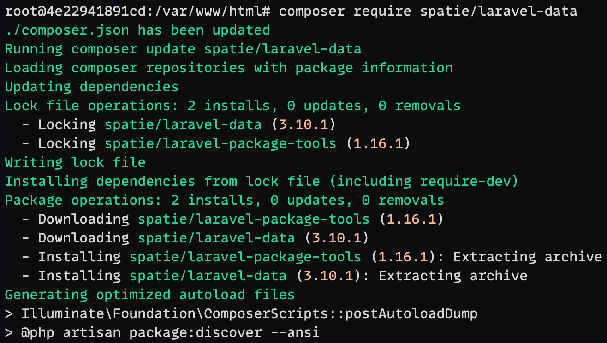

Pada tutorial ini, kita akan membahas bagaimana membangun sebuah REST API menggunakan framework Laravel yang merupakan salah satu framework PHP yang populer dan banyak
digunakan. REST API sangat berguna untuk membangun aplikasi yang dapat berinteraksi dengan platform lain seperti aplikasi mobile atau layanan front-end yang terpisah.

## Table of contents

## Membuat Proyek Laravel Baru

Sebelum kita memulai, pastikan bahwa Anda telah menginstall PHP, Composer, dan Laravel pada sistem Anda. Jika Anda belum menginstallnya, Anda bisa mengikuti panduan [instalasi resmi dari Laravel](https://laravel.com/docs/10.x/installation). Kita juga bisa menggunakan Docker untuk menginstall Laravel dengan mudah. Caranya, jalankan perintah dibawah ini:

```bash
docker run --rm \
    --pull=always \
    -v "$(pwd)":/opt \
    -w /opt \
    -it ramageek/php:beta-8.1-sprint-laravel \
    bash -c "laravel new laravel-rest-api"
```

_Command_ diatas kita akan menjalan sebuah _container_ Docker yang akan menginstall **Laravel** dengan **Laravel Installer** pada direktori `laravel-rest-api` yang ada di direktori kerja saat ini. Pada prosesnya, kita akan ditanyakan mengenai _setup_ yang akan digunakan. Berikut ini adalah contoh _setup_ yang saya gunakan:


Selanjutnya, kita akan membuat database yang khusus untuk keperluan testing. Buat berkas di folder **database** dengan nama `create-testing-database.sh` dan isi dengan kode berikut:

```bash
#!/usr/bin/env bash

mysql --user=root --password="$MYSQL_ROOT_PASSWORD" <<-EOSQL
    CREATE DATABASE IF NOT EXISTS testing;
    GRANT ALL PRIVILEGES ON \`testing%\`.* TO '$MYSQL_USER'@'%';
EOSQL
```

Kita buat sebuah _file_ bernama `docker-compose.yml` dengan isi sebagai berikut:

```yml
services:
  php:
    image: ramageek/php:beta-8.1-sprint
    ports:
      - "${APP_PORT:-8000}:80"
    volumes:
      - ".:/var/www/html"
    networks:
      - laravel-rest-api
    depends_on:
      - mariadb
  mariadb:
    image: "mariadb:10"
    ports:
      - "${FORWARD_DB_PORT:-3306}:3306"
    environment:
      MYSQL_ROOT_PASSWORD: "${DB_PASSWORD}"
      MYSQL_ROOT_HOST: "%"
      MYSQL_DATABASE: "${DB_DATABASE}"
      MYSQL_USER: "${DB_USERNAME}"
      MYSQL_PASSWORD: "${DB_PASSWORD}"
      MYSQL_ALLOW_EMPTY_PASSWORD: "yes"
    volumes:
      # mapping ke direktori storage/app/mariadb agar database tidak hilang saat container dihapus
      - "./storage/app/mariadb:/var/lib/mysql"
      # mapping ke berkas create-testing-database.sh agar database testing dapat dibuat saat container pertama kali dijalankan
      - "./database/create-testing-database.sh:/docker-entrypoint-initdb.d/10-create-testing-database.sh"
    networks:
      - laravel-rest-api
    healthcheck:
      test: ["CMD", "mysqladmin", "ping", "-p${DB_PASSWORD}"]
      retries: 3
      timeout: 5s
networks:
  laravel-rest-api:
    driver: bridge
```

## Konfigurasi Database

Edit file `.env` pada root proyek untuk mengatur database Anda:

```yml
DB_CONNECTION=mysql
DB_HOST=mariadb # host dbms dari salah satu services dalam docker-compose
DB_PORT=3306
DB_DATABASE=laravel
DB_USERNAME=laravel
DB_PASSWORD=secret
```

Sampai tahap ini, kita sudah memiliki proyek Laravel yang siap untuk digunakan.

## Masuk ke Dalam Server Proyek

Masuk ke dalam server proyek dengan menjalankan perintah berikut:

```bash
docker-compose exec php bash
```

Mulai saat ini, kita akan menggunakan perintah-perintah composer dan juga artisan untuk mengatur proyek Laravel di dalam _server_ yang telah kita buat berdasarkan berkas `docker-compose.yml` yang telah kita buat sebelumnya.

### Membuat Model dan Migration

Buat model beserta migration untuk database menggunakan artisan command:

```bash
php artisan make:model Product -m
```

Lalu, definisikan struktur tabel dalam migration file yang dibuat di direktori `database/migrations`. Contohnya:

```php
<?php

use Illuminate\Database\Migrations\Migration;
use Illuminate\Database\Schema\Blueprint;
use Illuminate\Support\Facades\Schema;

return new class extends Migration
{
    /**
     * Run the migrations.
     */
    public function up(): void
    {
        Schema::create('products', function (Blueprint $table) {
            $table->ulid('id')->primary();
            $table->string('name');
            $table->string('photo')->nullable();
            $table->string('model');
            $table->decimal('price', 10, 2);
            $table->timestamps();
            $table->softDeletes();
        });
    }

    /**
     * Reverse the migrations.
     */
    public function down(): void
    {
        Schema::dropIfExists('products');
    }
};
```

Sesuaikan juga _class_ `Product` yang ada di direktori `app/Models` dengan kode berikut:

```php
<?php

namespace App\Models;

use Illuminate\Database\Eloquent\Concerns\HasUlids;
use Illuminate\Database\Eloquent\Factories\HasFactory;
use Illuminate\Database\Eloquent\Model;
use Illuminate\Database\Eloquent\SoftDeletes;

class Product extends Model
{
    use HasFactory, HasUlids, SoftDeletes;

    protected $fillable = ['name', 'model', 'photo', 'price'];
}
```

### Instalasi Package Laravel Data

Laravel Data adalah sebuah _package_ yang dibuat oleh [Spatie](https://spatie.be/) yang berfungsi untuk mempermudah kita dalam mengatur data objek pada aplikasi Laravel. Untuk menginstallnya, jalankan perintah berikut:

```bash
composer require spatie/laravel-data
```



Dengan _package_ ini membuat lebih mudah untuk menciptakan objek data yang kaya dan bisa digunakan dalam banyak cara. Sehingga, kita hanya perlu menjelaskan data kamu sekali saja, misalnya:

1. Daripada membuat permintaan formulir, kamu bisa menggunakan objek data.
2. Daripada menggunakan pengubah API, kamu juga bisa menggunakan objek data.
3. Dan daripada menulis definisi TypeScript secara manual, yang kamu perlukan hanyalah... 🥁 sebuah objek data.

#### Membuat Objek Data untuk Product

Buat sebuah _file_ di direktori `app/Data` dengan nama `ProductData.php` dan isi dengan kode berikut:

```php
<?php

namespace App\Data;

use Illuminate\Support\Carbon;

class ProductData extends \Spatie\LaravelData\Data
{
    public function __construct(
        public ?string $id,
        public string $name,
        public ?string $photo,
        public string $model,
        public float $price,
        public ?Carbon $created_at,
        public ?Carbon $updated_at,
        public ?Carbon $deleted_at,
    ) {
    }
}
```

### Membuat Resource Controller

Untuk membuat REST API, kita perlu membuat controller yang akan menangani permintaan API. Gunakan artisan command untuk membuat controller:

```bash
php artisan make:controller Api/ProductController -m Product
```

Karena kita akan membuat API, ada 2 _method_ yang tidak kita perlukan pada _Controller_ ini, yaitu `create` dan `edit`. Kita bisa menghapusnya dari _class_ `ProductController` yang telah dibuat. Sehingga, _class_ `ProductController` akan memiliki 5 _method_ tersisa, yakni `index`, `show`, `store`, `update`, dan `destroy`.

Disinilah kita akan menggunakan data objek `ProductData`. Data ini akan menggantikan beberapa _class_ lain yang biasanya digunakan untuk mengatur data seperti `Request` dan `Resource`. Caranya:

1. Hapus baris `use Illuminate\Http\Request;`
2. Gantikan parameter pertama pada _method_ `store` dan `update` dengan `ProductData $request`

Hasil akhirnya, _class_ `ProductController` akan terlihat seperti ini:

```php
<?php

namespace App\Http\Controllers\Api;

use App\Data\ProductData;
use App\Http\Controllers\Controller;
use App\Models\Product;

class ProductController extends Controller
{
    /**
     * Display a listing of the resource.
     */
    public function index()
    {
        //
    }

    /**
     * Store a newly created resource in storage.
     */
    public function store(ProductData $request)
    {
        //
    }

    /**
     * Display the specified resource.
     */
    public function show(Product $product)
    {
        //
    }

    /**
     * Update the specified resource in storage.
     */
    public function update(ProductData $request, Product $product)
    {
        //
    }

    /**
     * Remove the specified resource from storage.
     */
    public function destroy(Product $product)
    {
        //
    }
}
```

### Membangun Fungsi Controller

Tuliskan fungsi-fungsi yang akan menangani operasi CRUD pada `ProductController`.

```php
/**
 * Display a listing of the resource.
 */
public function index()
{
    return ProductData::collection(Product::query()->paginate());
}

/**
 * Store a newly created resource in storage.
 */
public function store(ProductData $request)
{
    $attributes = $request->toArray();
    $data = Product::query()->create($attributes);

    return ProductData::from($data);
}

/**
 * Display the specified resource.
 */
public function show(Product $product)
{
    return ProductData::from($product);
}

/**
 * Update the specified resource in storage.
 */
public function update(ProductData $request, Product $product)
{
    $attributes = $request->only('name', 'photo', 'model', 'price')->toArray();
    $product->update($attributes);

    return response()->noContent();
}

/**
 * Remove the specified resource from storage.
 */
public function destroy(Product $product)
{
    $product->delete();

    return response()->noContent();
}
```

### Mendefinisikan Route

Tambahkan route untuk API di dalam file `routes/api.php`:

```php
Route::apiResource('products', \App\Http\Controllers\Api\ProductController::class)
    ->except(['create', 'edit']);
```

Validasi route yang telah kita buat dengan menjalankan perintah berikut:

```bash
php artisan route:list
```


## Menguji API

Gunakan Postman atau alat uji coba API lainnya untuk menguji fungsi-fungsi API yang telah Anda buat. Pastikan bahwa endpoints bekerja sesuai kebutuhan CRUD.

## Penutup

Sekarang Anda sudah memiliki REST API untuk _product_ yang berfungsi dengan Laravel. Selanjutnya, kita akan membahas bagaimana cara [meningkatkan _developer experience_](/posts/laravel-10-memaksimalkan-developer-experience) agar lebih mudah dalam mengatur API yang telah kita buat dan juga menerapkan _best practice_ dalam membangun REST API.

Semoga tutorial singkat ini bermanfaat dan memberi Anda dasar yang kuat dalam membangun REST API menggunakan Laravel. Selamat _coding_!

## Video Tutorial Membuat REST API dengan Laravel

<div class="aspect-w-16 aspect-h-9">
  <iframe src="https://www.youtube.com/embed/f2MeSnYc7HE" title="Video Membuat REST API dengan Laravel | Panduan Komprehensif" frameborder="0" allow="accelerometer; autoplay; clipboard-write; encrypted-media; gyroscope; picture-in-picture" allowfullscreen></iframe>
</div>
